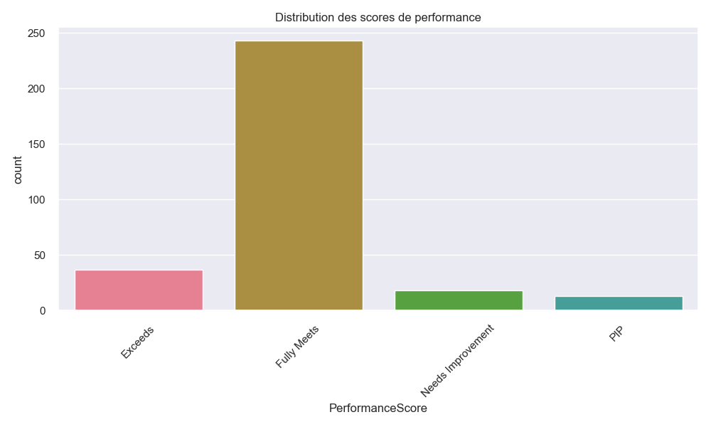
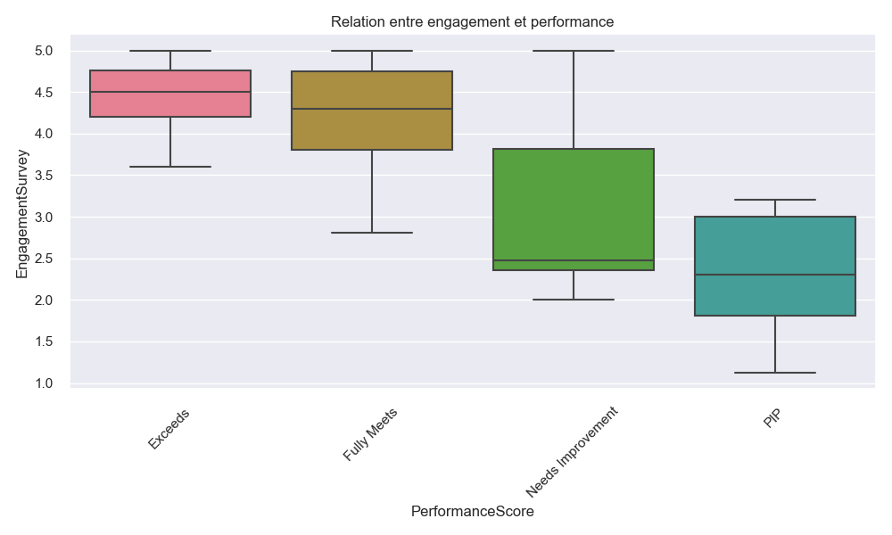
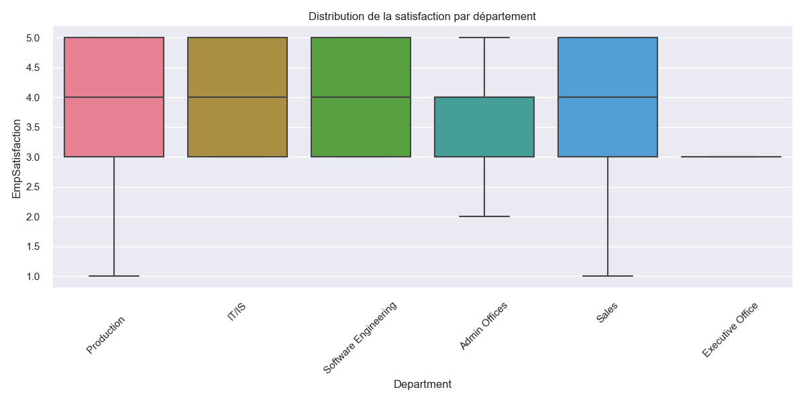
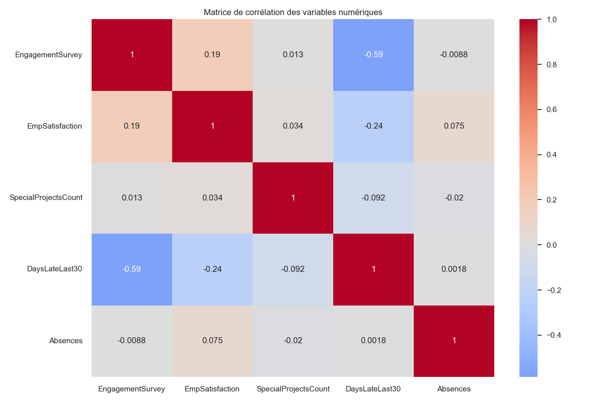

# Analyse des Performances des Employés - Projet d'Apprentissage Data Science

## 📊 À propos du projet
Ce projet a été réalisé dans le cadre de mon apprentissage du métier de Data Scientist. En tant que ébutant dans ce domaine, j'ai choisi de travailler sur une problématique concrète d'analyse de données RH pour développer mes compétences en analyse de données.

## 🎯 Problématique
Une entreprise souhaite analyser la répartition des performances de ses employés pour comprendre les écarts et identifier les outliers. Cette analyse permettra de mieux comprendre les facteurs qui influencent la performance et d'identifier les axes d'amélioration.

## 🎓 Objectifs d'apprentissage
- Apprendre à manipuler et analyser des données avec Python
- Développer des compétences en visualisation de données
- Comprendre les méthodes statistiques pour l'analyse de données
- Pratiquer l'identification des outliers
- Apprendre à générer des insights actionnables

## 🛠️ Compétences développées
1. **Programmation Python**
   - Utilisation de pandas pour la manipulation de données
   - Utilisation de numpy pour les calculs statistiques
   - Utilisation de matplotlib et seaborn pour la visualisation

2. **Analyse de données**
   - Nettoyage et préparation des données
   - Analyse statistique descriptive
   - Identification des outliers
   - Analyse des corrélations

3. **Visualisation**
   - Création de graphiques pertinents
   - Utilisation de différents types de visualisations
   - Interprétation des visualisations

4. **Statistiques**
   - Tests statistiques (chi-carré)
   - Analyse de corrélation
   - Calcul d'intervalles de confiance

## 📈 Résultats obtenus

### 1. Distribution des performances

*Distribution des scores de performance des employés*

### 2. Facteurs d'influence

*Relation entre l'engagement et la performance*

### 3. Analyse par département

*Distribution de la satisfaction par département*

### 4. Corrélations

*Matrice de corrélation des variables numériques*

## 🔍 Principales découvertes
1. **Facteurs significatifs** :
   - Le statut d'emploi influence significativement la performance
   - L'engagement est positivement corrélé avec la performance
   - L'absentéisme a un impact négatif sur la performance

2. **Outliers identifiés** :
   - Nombre d'outliers : 68
   - Caractéristiques communes des outliers
   - Facteurs de risque associés

3. **Recommandations** :
   - Amélioration de l'engagement dans les départements à faible performance
   - Gestion de l'absentéisme dans les départements concernés
   - Développement des compétences via les projets spéciaux

## 💡 Remarques et apprentissages
1. **Défis rencontrés** :
   - Gestion des données manquantes
   - Choix des méthodes statistiques appropriées
   - Interprétation des résultats

2. **Points d'amélioration** :
   - Approfondir l'analyse temporelle
   - Ajouter des tests statistiques plus avancés
   - Améliorer la visualisation des résultats

3. **Leçons apprises** :
   - Importance du nettoyage des données
   - Nécessité de bien comprendre le contexte métier
   - Value de la visualisation pour la communication

## 📝 Conclusion
Ce projet m'a permis de mettre en pratique les concepts fondamentaux de l'analyse de données dans un contexte réel. J'ai pu développer mes compétences techniques tout en apprenant à interpréter les résultats et à formuler des recommandations actionnables.

### Prochaines étapes d'apprentissage
- Approfondir les méthodes statistiques avancées
- Explorer le machine learning pour la prédiction
- Améliorer les compétences en visualisation de données
- Étudier d'autres domaines d'application

## 🛠️ Technologies utilisées
- Python 3.x
- pandas
- numpy
- matplotlib
- seaborn
- scipy

## 📚 Ressources d'apprentissage
- Documentation Python
- Cours en ligne sur l'analyse de données
- Tutoriels sur la visualisation de données
- Livres sur les statistiques

## Contact

Pour toute question ou suggestion concernant ce projet, n'hésitez pas à me contacter :

  - Email : fijmmywilson@gamil.com
  - GitHub : ThePerformer0
  - Nom : FEKE JIMMY

Je serai ravi de répondre à vos questions et d'échanger sur le projet !

---
*Ce projet a été réalisé dans le cadre de mon apprentissage du métier de Data Scientist. Les résultats et analyses présentés sont le fruit de mes premières expériences dans ce domaine.*
